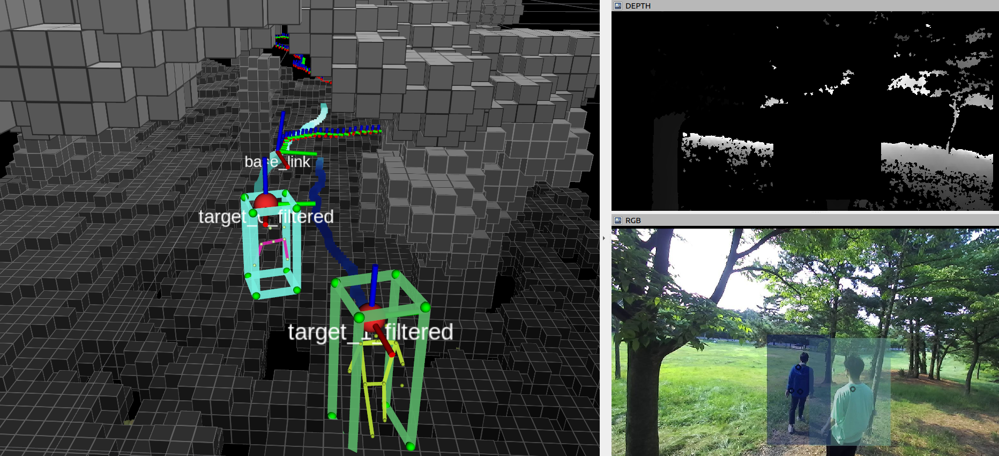
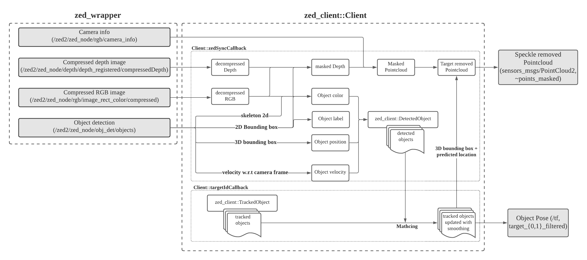

# zed2_client
___



## Features


### 1. Receiving compressed images only and creating points in a client computer 
In an onboard system for ZED camera, 
it is common to use jetson (server of ZED) leveraging nvidia gpu, along with small computer (client) such as NUC having better cpu.
In this case, the Ethernet networking is not feasible for transmitting pointcloud in real time (less than 1Hz in case of 720HD).   
Instead, the compressed RGB and depth can be transported to NUC from jetson at about 10Hz (assuming png compression lever 1 for depth image). 
Considering this network limit and computation capability of NUC, this package regenerates pointcloud in the NUC side. 
The decompression process is internalized without using [republish](https://wiki.ros.org/image_transport#republish) node for efficiency. 
> This package assumes that RGB is in jepg compression and depth in png (no openni depth mode). Please observe this when running zed_wrapper in the server side.  
### 2. Filtering and tracking objects of interests (single and dual target only supported)

### 3. Removing pointcloud related with target objects (also with bleeding of stereo depth)


## Installation 

### Dependencies
#### [compressed_depth_image_transport](http://wiki.ros.org/compressed_depth_image_transport)
```
 sudo apt-get install ros-${ROS_DISTRO}-compressed-depth-image-transport
```
    
#### [zed_interfaces](https://github.com/stereolabs/zed-ros-wrapper/tree/master/zed_interfaces)
```
cd catkin_ws/src
git clone https://github.com/stereolabs/zed-ros-wrapper.git
catkin build zed_interfaces 
catkin build zed_wrapper
```

#### [dynamicEDT3d (my fork version)](https://github.com/icsl-Jeon/octomap)
```
git clone https://github.com/icsl-Jeon/octomap
cd dynamicEDT3D
mkdir build && cmake .. 
sudo make install
```

#### [octomap_server (my fork version)](https://github.com/icsl-Jeon/octomap_mapping) 
```
cd catkin_ws/src
git clone https://github.com/icsl-Jeon/octomap_mapping
catkin build octomap_server
```
#### This package 
```
cd catkin_ws/src
git clone /github.com/icsl-Jeon/zed2_client.git
catkin build zed2_client
```


## Launch 

```
roslaunch zed2_client client.launch is_bag:=true
```
## Matching between the tracked objects and newly detected objects 

### Matching score

### Assumptions 

* **Accept** : if there is o newly observed object with same zed labeling, match it.
* **Accept** : two objects with hsv color difference smaller than `matching_select_prior_color_diff` and `matching_select_prev_distance_diff`
  will have an advantage by having only the velocity cost.
* **Reject** : two objects having distance difference larger than `matching_rejection_prior_dist_diff`.
* **Reject** : two objects having color difference larger than  `matching_rejection_prior_color_diff`. If lighting conditions are varying, set large number..


